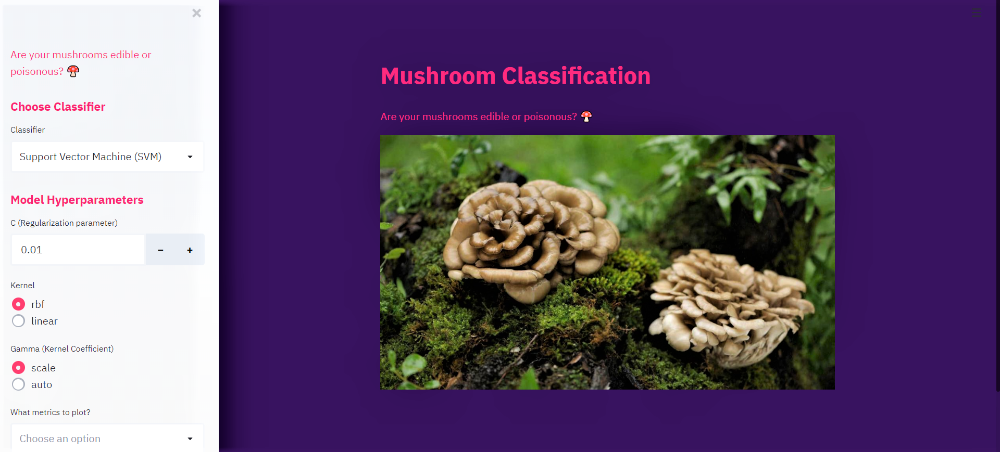

# Streamlit Web App for 🍄Mushroom Classsification

A simple classification Web App using streamlit (with dark mode influences.)

Made using [Streamlit](https://github.com/streamlit/streamlit)❤️

### Features
- Train , chose and view results interactively.
- Interactive data visualization.


# How to run
``` streamlit run app.py ```

# Requirements
Overview
 ```  
 - pandas 
 - plotly
 - streamlit
 - numpy
 - scikit-learn
 - pillow
 - matplotlib
```
 Refer **requirements.txt** for more accuracte details.
 
 
 
 
 
 
 
 
 **NOTE:**  Use top left corner  to collapse and view sidebar


